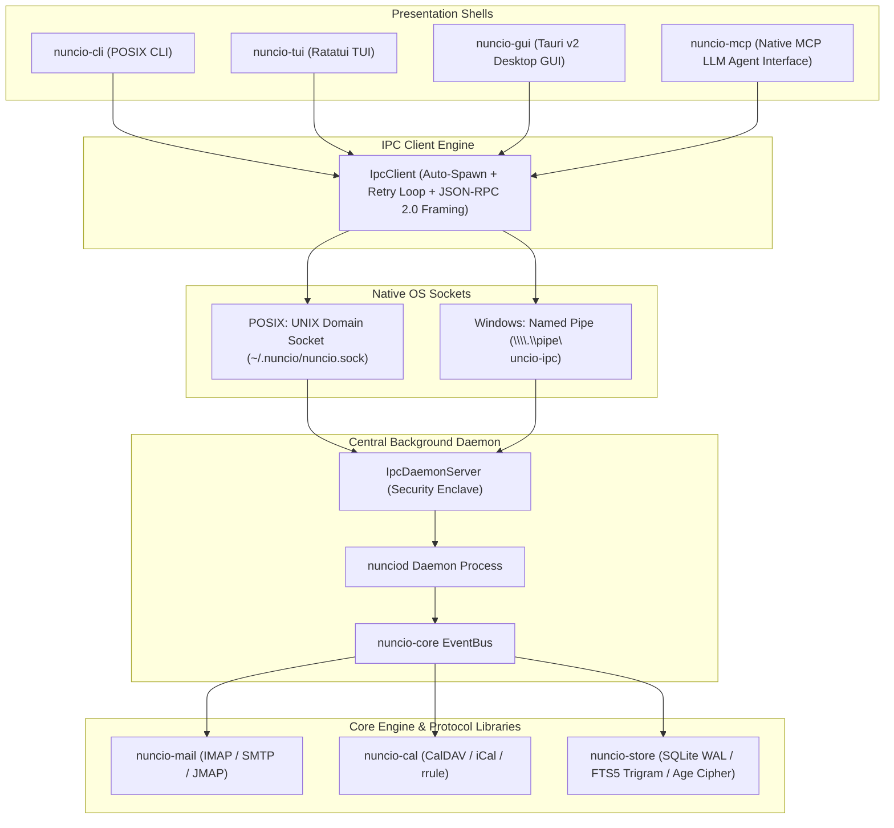

# Nuncio

<p align="center">
  
</p>

<h3 align="center">Nuncio Mail & Calendar Suite</h3>

<p align="center">
  <b>High-Performance Library-First Messenger and Calendar Courier for Developers, Power Users, and AI Agents</b>
</p>

<p align="center">
  <a href="https://nuncio.mx">Official Site: nuncio.mx</a> •
  <a href="https://github.com/KofTwentyTwo/nuncio">GitHub Repository</a>
</p>

> **Etymology**: Derived from the Latin verb ***nūntiō*** ("I announce", "I declare", "I deliver a message") and noun ***nūntius*** ("messenger", "courier", "bearer of tidings"). Nuncio is built as the ultimate cross-platform messenger and calendar courier across Linux, macOS, and Windows.

---

## Visual Application Preview


---

## 4 Presentation Interfaces + Central Daemon Topology

Nuncio operates on a **Hybrid Daemon-First Architecture**. Centralized state management, SQLite WAL persistence, credential security enclaves, and protocol synchronizers reside inside a standalone background daemon (`nunciod`). Four decoupled presentation interfaces communicate with `nunciod` over native IPC socket streams:



1. **`nuncio-cli` (POSIX CLI)**: Scriptable `<Noun> <Verb>` commands with deterministic `--json` output and offline-resilient local SQLite reads.
2. **`nuncio-tui` (Terminal TUI)**: Keyboard-first 3-pane split view built in Ratatui with Vim navigation (`j`/`k`/`h`/`l`) and live `CoreEvent` push updates.
3. **`nuncio-gui` (Tauri v2 Desktop GUI)**: Cross-platform native window host with React 18 + Vite + TypeScript frontend, glassmorphic styling, and strict HTML `<iframe sandbox>` CSP email rendering.
4. **`nuncio-mcp` (Native LLM Agent UI)**: Model Context Protocol (MCP) JSON-RPC 2.0 stdio server exposing tools (`nuncio_mail_send`, `nuncio_cal_create_event`), resources (`nuncio://mail/inbox`), and prompts for local AI agents (Claude, Cursor, Antigravity).
5. **`nunciod` (Central Daemon Binary)**: Standalone background process owning SQLite WAL storage, security enclaves, background protocol sync loops, and multi-client IPC socket streams.

---

## Workspace Crate Architecture

The Nuncio Cargo workspace is modularized into 9 crates with strict domain boundaries:

| Crate Path | Architectural Role & Description |
| :--- | :--- |
| `crates/nuncio-core` | Core domain models (`Email`, `CalendarEvent`, `Folder`), `EventBus`, and `IpcClient`/`IpcDaemonServer` framing & JSON-RPC protocol. |
| `crates/nuncio-mail` | IMAP4rev1, JMAP (RFC 8620/8621), SMTP transport engines, and MIME stream parser. |
| `crates/nuncio-cal` | CalDAV (RFC 4791) client, iCalendar (RFC 5545) parser, and `rrule` recurrence engine. |
| `crates/nuncio-store` | SQLite WAL persistence (`DatabaseEngine`), FTS5 trigram search index, AES-256-GCM column cipher, `age` attachment stream cipher, and OS Keyring vault integration. |
| `crates/nuncio-cli` | Pure Noun + Verb CLI runner and Unix pipe scripting engine. |
| `crates/nuncio-tui` | Terminal user interface powered by Ratatui and crossterm. |
| `crates/nuncio-gui` | Native desktop GUI application shell powered by Tauri v2 and React. |
| `crates/nuncio-mcp` | MCP stdio server providing LLM agents direct read/write access. |
| `crates/nunciod` | Standalone background daemon binary server. |

---

## CLI Command Usage (Pure Noun + Verb Syntax)

Nuncio CLI enforces standardized `<Noun> <Verb> [Flags]` syntax with optional `--json` output envelopes:

```bash
# Account Management
nuncio account add --email james.maes@kof22.com --imap-host mail.kof22.com --imap-port 993
nuncio account list --json

# Mail Operations
nuncio mail sync [--account <id>]
nuncio mail list --folder INBOX --limit 50
nuncio mail read --id msg_123
nuncio mail search --query "roadmap"
nuncio mail send --to alice@nuncio.mx --subject "Release Update" --body "Message body"

# Calendar Operations
nuncio cal list --calendar work
nuncio cal create --summary "Team Standup" --start 1774348800 --end 1774352400

# System Status
nuncio system status --json
nuncio daemon
```

---

## Quality Gates & Verification Commands

Build configurations enforce strict zero-warning policy (`-D warnings -F unsafe_code -D unused_must_use`):

```bash
# 1. Compiler & Linter Quality Gate (Zero warnings allowed)
cargo check --workspace
cargo clippy --workspace -- -D warnings

# 2. Run Full Integration Test Suite (100 tests across 9 crates)
cargo test --workspace

# 3. Formatter Gate
cargo fmt --all --check
```

---

## Master Architectural Documentation & Roadmaps

- **[Enhanced Production Roadmap (V1, V2, V3)](docs/PLAN-enhanced-roadmap-v1-v2-v3.md)**: Deep commercial feature specification benchmarked against Superhuman, Mimestream, Apple Mail, Outlook, Hey, Cron, and Fantastical.
- **[Hybrid Daemon Architecture Blueprint](docs/PLAN-hybrid-daemon-architecture.md)**: Sockets, framing, auto-spawning, and security enclave design.
- **[Executive Audit Review Report](docs/EXECUTIVE-AUDIT-REVIEW.md)**: Authoritative technical audit scorecard across architecture, security, code quality, UI/UX, and performance.
- **[Architecture Specification](docs/ARCHITECTURE.md)**: Domain encapsulation, Hexagonal Ports & Adapters model, and IPC streaming contracts.

---

## Single Source of Truth for Execution

Project planning, issue tracking, atomic micro-milestones, and subagent assignments are authoritatively managed directly on GitHub:

- **GitHub Project Board**: [Nuncio Roadmap Project #5](https://github.com/users/KofTwentyTwo/projects/5)
- **GitHub Milestones**: [KofTwentyTwo/nuncio/milestones](https://github.com/KofTwentyTwo/nuncio/milestones) (`v0.1.0` through `v1.0.0`)
- **GitHub Issues**: [KofTwentyTwo/nuncio/issues](https://github.com/KofTwentyTwo/nuncio/issues)

---

## License

MIT OR Apache-2.0
