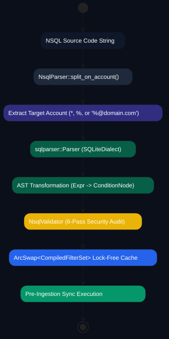

# NSQL Filter Language & Webhook Specification

> **Status:** the parser, validator, and match engine are genuinely implemented.
> `ON ACCOUNT` scoping and non-ASCII rule parsing are correct (Phase 3.A, done).
> **Actions still do not execute against live mail** — the match-and-act engine
> is not yet wired into the sync path, and webhook dispatch (`CALL WEBHOOK`) is
> unwired end-to-end — and header (`header['X-...']`) conditions always
> evaluate `false` (hardcoded). These are tracked as roadmap M4.

Nuncio SQL Filter Language (NSQL) is a declarative, high-throughput email routing and automation language powered by `sqlparser-rs`.

---

## 1. NSQL Compiler Pipeline & Validation Flowchart



---

## 2. NSQL Syntax Grammar

The parser (`crates/nuncio-filter/src/parser.rs`) accepts an optional
`ON ACCOUNT` clause, a `sqlparser`-parsed `WHERE`-style condition, and a
comma-separated `ACTION` clause — not the `WHEN`/`THEN` form this section
previously described:

```sql
/* Complete NSQL Statement Syntax */
[ON ACCOUNT '<target_account>']
[WHERE] <field> <operator> <value> [AND|OR <condition>]
ACTION <action_1> [, <action_2> ...];
```

### Supported Fields & Operators
- **Fields**: `subject`, `from`, `to`, `body`, `header['X-Spam-Score']`, `has_attachment`, `size`, `folder`, `date`, `account`.
- **Operators**: `=`, `!=`, `CONTAINS`, `NOT CONTAINS`, `MATCHES` (regex), `>`, `<`, `>=`, `<=`, `IN ('a', 'b')`, `NOT IN ('a', 'b')`.
- **Actions**: `MOVE TO 'folder'`, `COPY TO 'folder'`, `MARK READ`, `MARK UNREAD`, `FLAG`, `UNFLAG`, `DELETE`, `FORWARD TO 'email'`, `CALL WEBHOOK 'url'`.

---

## 3. Webhook Dispatch

`CALL WEBHOOK` actions dispatch through `crates/nuncio-filter/src/webhook.rs`:
an outbound HTTP POST signed with an HMAC-SHA256 signature, with SSRF defenses
on the target URL. As noted above, this dispatcher exists but is not yet
invoked from the live sync path (roadmap M4). *(A previous diagram in this
section depicted the removed length-prefixed JSON-RPC IPC transport, not the
webhook flow, and has been removed as inaccurate.)*
