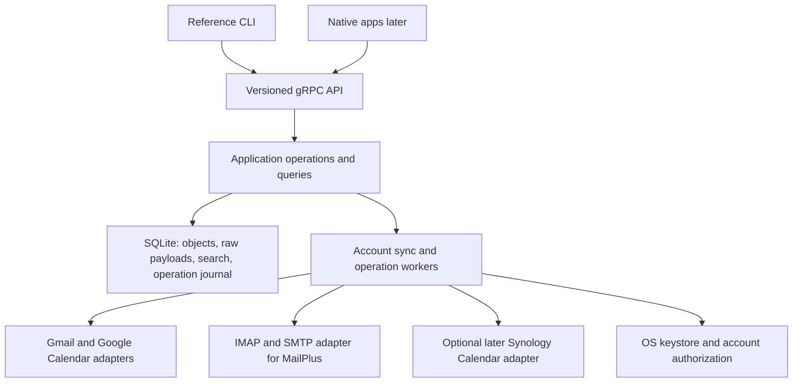

# Nuncio: Engineering Audit and Rebuild Proposal

**Date:** September 10, 2026\
**Status:** Proposed direction for discussion; implementation not authorized\
**Reviewed baseline:** `dev` at `a268fd5a004977b65fd0347ceeb1c69755529aa3`\
**Product scope:** Engine and CLI first, native applications later; Google first, then IMAP/Synology MailPlus

## Executive summary

The current project contains substantial working engineering. It is still an unreliable foundation for daily mail and calendar use: protocol compatibility, data preservation, calendar semantics, and operation recovery have material gaps. A focused restart is reasonable, but the evidence does not justify discarding Rust, SQLite, gRPC, or every existing implementation. Restart the product scope and core data/operation model, then selectively reuse verified components.

The confirmed product direction is: **engine and CLI first, native applications later; Google first, then IMAP/Synology MailPlus**. The design below is a proposal, not an approved implementation plan or a change to the repository's accepted ADRs. No source, dependencies, Git refs, or live accounts were changed.

## Scope and verification

Reviewed the nine active Rust crates, daemon composition, protocol/storage/mutation paths, calendar and contact models, filter execution, gRPC/CLI contract, authentication, encryption, recovery/export, test seams, CI/release configuration, and repository planning/history. The archived GUI/TUI/MCP shells were considered reference material, not active products. The tree contains 39 RPCs and roughly 61,600 Rust lines including tests; size is not evidence of usable capabilities.

- `cargo fmt --all -- --check`: passed.
- `CARGO_NET_OFFLINE=true cargo check-all`: passed on pinned Rust 1.97.1.
- `CARGO_NET_OFFLINE=true RUST_TEST_THREADS=2 cargo test-all`: **788 passed, 0 failed, 0 ignored**, across 32 nonempty result groups. The initial sandboxed attempt stopped with local Wiremock port-binding denials; the authorized rerun with loopback listeners enabled passed. macOS SDK tooling emitted environment warnings during compilation.
- Reproduced CLI error status: pointing `system status --json` at an unavailable loopback endpoint with a dummy token returns an error object but **process exit code 0**. No keyring or live daemon was accessed.
- Local Git-history Gitleaks scan reported one historical Tauri updater `pubkey` field. It is public verification material, not a confirmed credential leak. No credential values were printed.
- No live Google, Synology, or other mailbox/calendar integration was exercised. Findings are source traces, test inspection, one CLI reproduction, and public protocol documentation. No current Rust dependency-vulnerability scan was run because `cargo-audit` is unavailable. This is not a penetration test or an exhaustive proof that no other defects exist.

The July forensic assessment describes an older, much less functional system. It must not be copied forward as current truth. Conversely, the August handoff's completed-feature statements and manual-use guide are also stale: mutation RPCs now exist, while calendar writes still do not. Code and fresh verification take precedence.

## Findings

P1 means a blocker for trusting the affected capability with daily work. P2 means significant usability, scale, or safety work before dependable use. Several findings are already acknowledged as incomplete in comments or planning documents; they remain product gaps even when deliberately deferred.

| Priority | Finding and consequence | Evidence |
|---|---|---|
| P1 | **Calendar identities can overwrite other accounts' events.** CalDAV derives IDs from response positions, while SQLite uses a global primary key and replacement writes. A second calendar's first event can replace the first calendar's first event. Reordered/windowed results also change identity. CardDAV uses account-scoped but still position-derived IDs. | [CalDAV identity](https://github.com/KofTwentyTwo/nuncio/blob/a268fd5a004977b65fd0347ceeb1c69755529aa3/crates/nuncio-cal/src/caldav.rs#L135), [calendar table](https://github.com/KofTwentyTwo/nuncio/blob/a268fd5a004977b65fd0347ceeb1c69755529aa3/crates/nuncio-store/src/db.rs#L1019), [save event](https://github.com/KofTwentyTwo/nuncio/blob/a268fd5a004977b65fd0347ceeb1c69755529aa3/crates/nuncio-store/src/db.rs#L2320), [CardDAV identity](https://github.com/KofTwentyTwo/nuncio/blob/a268fd5a004977b65fd0347ceeb1c69755529aa3/crates/nuncio-contacts/src/carddav.rs#L127) |
| P1 | **Calendar/contact deletions never reconcile.** Sync only upserts. A deleted remote contact remains locally; a deleted recurring master continues producing appointments. Empty, complete, partial, and malformed responses need distinct semantics. | [Calendar sync](https://github.com/KofTwentyTwo/nuncio/blob/a268fd5a004977b65fd0347ceeb1c69755529aa3/crates/nunciod/src/calendar_sync.rs#L63), [contacts sync](https://github.com/KofTwentyTwo/nuncio/blob/a268fd5a004977b65fd0347ceeb1c69755529aa3/crates/nunciod/src/contacts_sync.rs#L52) |
| P1 | **Calendar normalization changes appointments.** The parser returns the first VEVENT and drops exception/override structure. Recurrence rebuilds DTSTART in UTC, losing the original recurring wall-clock zone across DST. Date-only DTEND is turned into 23:59:59 on an exclusive end date, extending all-day events. | [Parser](https://github.com/KofTwentyTwo/nuncio/blob/a268fd5a004977b65fd0347ceeb1c69755529aa3/crates/nuncio-cal/src/parser.rs#L104), [recurrence expansion](https://github.com/KofTwentyTwo/nuncio/blob/a268fd5a004977b65fd0347ceeb1c69755529aa3/crates/nuncio-cal/src/rrule.rs#L30) |
| P1 | **JMAP uses incompatible request/response fields.** It sends `inMailboxes`, requests `isUnread`/`bodySnippet`, and deserializes numeric `receivedAt`. Standard JMAP uses `inMailbox`, keyword/body properties, and a date string. Fixtures reproduce the implementation's invented representation. | [Response model](https://github.com/KofTwentyTwo/nuncio/blob/a268fd5a004977b65fd0347ceeb1c69755529aa3/crates/nuncio-mail/src/jmap.rs#L162), [request construction](https://github.com/KofTwentyTwo/nuncio/blob/a268fd5a004977b65fd0347ceeb1c69755529aa3/crates/nuncio-mail/src/jmap.rs#L274), [fixture](https://github.com/KofTwentyTwo/nuncio/blob/a268fd5a004977b65fd0347ceeb1c69755529aa3/crates/nuncio-mail/tests/wiremock_jmap_test.rs#L55); [RFC 8621](https://www.rfc-editor.org/rfc/rfc8621.html#section-4.1) |
| P1 | **JMAP full enumeration is only one page.** The code marks one query/get result complete; sync removes local placements absent from it. A provider page cap therefore causes omissions or local disappearance during resync. Fixing the wire model alone is insufficient. | [Full enumeration](https://github.com/KofTwentyTwo/nuncio/blob/a268fd5a004977b65fd0347ceeb1c69755529aa3/crates/nuncio-mail/src/jmap.rs#L758), [placement reconciliation](https://github.com/KofTwentyTwo/nuncio/blob/a268fd5a004977b65fd0347ceeb1c69755529aa3/crates/nunciod/src/sync.rs#L363); [JMAP pagination](https://www.rfc-editor.org/rfc/rfc8620.html#section-5.5) |
| P1 | **Quiet IMAP delta sync can emit an invalid FETCH.** No changed UIDs becomes an empty sequence string, which is still passed to `uid_fetch`. The mock accepts malformed syntax, hiding failures on strict servers and potentially preventing removal-only reconciliation. | [Empty set](https://github.com/KofTwentyTwo/nuncio/blob/a268fd5a004977b65fd0347ceeb1c69755529aa3/crates/nuncio-mail/src/imap.rs#L1222), [unconditional fetch](https://github.com/KofTwentyTwo/nuncio/blob/a268fd5a004977b65fd0347ceeb1c69755529aa3/crates/nuncio-mail/src/imap.rs#L898), [permissive mock](https://github.com/KofTwentyTwo/nuncio/blob/a268fd5a004977b65fd0347ceeb1c69755529aa3/crates/nuncio-mail/src/test_server.rs#L772); [IMAP grammar](https://www.rfc-editor.org/rfc/rfc3501.html#section-9) |
| P1 | **Common IMAP folder names are not quoted.** Raw SELECT/COPY/MOVE command construction breaks names containing spaces such as `Sent Items`. Account sync can stop before processing subsequent folders. | [SELECT](https://github.com/KofTwentyTwo/nuncio/blob/a268fd5a004977b65fd0347ceeb1c69755529aa3/crates/nuncio-mail/src/imap.rs#L1173), [QRESYNC SELECT](https://github.com/KofTwentyTwo/nuncio/blob/a268fd5a004977b65fd0347ceeb1c69755529aa3/crates/nuncio-mail/src/imap_raw.rs#L297), [COPY](https://github.com/KofTwentyTwo/nuncio/blob/a268fd5a004977b65fd0347ceeb1c69755529aa3/crates/nuncio-mail/src/imap.rs#L1756) |
| P1 | **Received attachments disappear at persistence.** MIME parsing extracts attachments, the message INSERT does not persist them, and readback returns an empty vector. Reading or auto-forwarding a received PDF loses its attachment. | [MIME parse](https://github.com/KofTwentyTwo/nuncio/blob/a268fd5a004977b65fd0347ceeb1c69755529aa3/crates/nuncio-mail/src/parser.rs#L107), [save](https://github.com/KofTwentyTwo/nuncio/blob/a268fd5a004977b65fd0347ceeb1c69755529aa3/crates/nuncio-store/src/db.rs#L1708), [readback](https://github.com/KofTwentyTwo/nuncio/blob/a268fd5a004977b65fd0347ceeb1c69755529aa3/crates/nuncio-store/src/db.rs#L3396), [forward](https://github.com/KofTwentyTwo/nuncio/blob/a268fd5a004977b65fd0347ceeb1c69755529aa3/crates/nunciod/src/outbox.rs#L530) |
| P1 | **Uncertain remote outcomes are replayed indiscriminately.** `Unknown` always becomes retry. IMAP COPY may have succeeded without COPYUID or before a lost acknowledgement; repeating it creates copies. Forwarding has the analogous acceptance/acknowledgement ambiguity. A remote timeout is not proof that nothing happened. | [Retry policy](https://github.com/KofTwentyTwo/nuncio/blob/a268fd5a004977b65fd0347ceeb1c69755529aa3/crates/nunciod/src/outbox.rs#L478), [COPY result classification](https://github.com/KofTwentyTwo/nuncio/blob/a268fd5a004977b65fd0347ceeb1c69755529aa3/crates/nuncio-mail/src/imap.rs#L128); [COPYUID semantics](https://www.rfc-editor.org/rfc/rfc4315.html#section-3) |
| P1 | **Filter actions lose their source placement.** The rule is evaluated against a placement, but enqueue drops that address. The executor correctly refuses to guess for messages occupying multiple folders, making normal multi-label/multi-folder rule actions fail permanently. | [Enqueue](https://github.com/KofTwentyTwo/nuncio/blob/a268fd5a004977b65fd0347ceeb1c69755529aa3/crates/nunciod/src/sync.rs#L211), [ambiguity rejection](https://github.com/KofTwentyTwo/nuncio/blob/a268fd5a004977b65fd0347ceeb1c69755529aa3/crates/nunciod/src/outbox.rs#L424) |
| P1 | **The filter claim and outbox are not one transaction.** The fire-once claim commits before local changes, queued actions, and execution logs. A crash or failed queue write in between suppresses work that was never durably recorded. | [Claim](https://github.com/KofTwentyTwo/nuncio/blob/a268fd5a004977b65fd0347ceeb1c69755529aa3/crates/nunciod/src/sync.rs#L139), [subsequent writes](https://github.com/KofTwentyTwo/nuncio/blob/a268fd5a004977b65fd0347ceeb1c69755529aa3/crates/nunciod/src/sync.rs#L174) |
| P1 | **Automatic repair resumes without durable local state.** Salvage restores accounts/filter/audit tables, then replaces the active database. It omits local contacts, queued actions/conflicts, and fire-once records. Upstream resync cannot restore local-only intent. A backup may permit manual recovery; the replacement is not a complete recovery. | [Salvaged table set](https://github.com/KofTwentyTwo/nuncio/blob/a268fd5a004977b65fd0347ceeb1c69755529aa3/crates/nuncio-store/src/recovery.rs#L217), [replacement](https://github.com/KofTwentyTwo/nuncio/blob/a268fd5a004977b65fd0347ceeb1c69755529aa3/crates/nuncio-store/src/recovery.rs#L254) |
| P1 | **Repair ignores failed WAL backup.** It ignores WAL copy failure, then removes the original WAL. Under I/O failure or disk pressure, committed transactions may disappear from both active state and the backup. | [Ignored copy](https://github.com/KofTwentyTwo/nuncio/blob/a268fd5a004977b65fd0347ceeb1c69755529aa3/crates/nuncio-store/src/recovery.rs#L168), [WAL deletion](https://github.com/KofTwentyTwo/nuncio/blob/a268fd5a004977b65fd0347ceeb1c69755529aa3/crates/nuncio-store/src/recovery.rs#L260) |
| P1 | **MBOX/EML exports are lossy.** They reconstruct plaintext messages instead of preserving MIME, losing HTML-only bodies, attachments, and original headers/identity. MBOX body separator lines are not escaped. Successful counts do not establish backup fidelity. | [MBOX writer](https://github.com/KofTwentyTwo/nuncio/blob/a268fd5a004977b65fd0347ceeb1c69755529aa3/crates/nuncio-core/src/export.rs#L107), [EML writer](https://github.com/KofTwentyTwo/nuncio/blob/a268fd5a004977b65fd0347ceeb1c69755529aa3/crates/nuncio-core/src/export.rs#L137) |
| P1 | **An export path can truncate the live database.** The daemon accepts an output path and uses `File::create`. An authenticated client's mistaken destination or symlink can overwrite the store. This is an accidental-data-loss hazard, not an unauthenticated exploit. | [Output creation](https://github.com/KofTwentyTwo/nuncio/blob/a268fd5a004977b65fd0347ceeb1c69755529aa3/crates/nuncio-store/src/db.rs#L3594), [RPC boundary](https://github.com/KofTwentyTwo/nuncio/blob/a268fd5a004977b65fd0347ceeb1c69755529aa3/crates/nunciod/src/grpc.rs#L3235) |
| P2 | **CLI errors return success to the shell.** The runner returns formatted strings and `main` always finishes with `Ok(())`. Reproduced with an unreachable daemon. Automation must currently parse the body to discover failure. | [CLI entry point](https://github.com/KofTwentyTwo/nuncio/blob/a268fd5a004977b65fd0347ceeb1c69755529aa3/crates/nuncio-cli/src/main.rs#L35) |
| P2 | **Calendar command defaults are unusable.** `cal sync` supplies `i64::MAX` as its end, rejected by the production date conversion. The analogous listing bound fails recurrence expansion, which can fall back to raw masters. | [Defaults](https://github.com/KofTwentyTwo/nuncio/blob/a268fd5a004977b65fd0347ceeb1c69755529aa3/crates/nuncio-cli/src/args.rs#L495), [conversion](https://github.com/KofTwentyTwo/nuncio/blob/a268fd5a004977b65fd0347ceeb1c69755529aa3/crates/nuncio-cal/src/caldav.rs#L162), [fallback](https://github.com/KofTwentyTwo/nuncio/blob/a268fd5a004977b65fd0347ceeb1c69755529aa3/crates/nunciod/src/grpc.rs#L1178) |
| P2 | **Configured background sync is not wired.** Intervals are persisted, but daemon sync waits for explicit commands/RPCs; IMAP IDLE helpers have no production caller. The active timers drain the outbox and optionally check updates. This is a manually triggered engine, not continuously current mail/calendar. | [Daemon command loop](https://github.com/KofTwentyTwo/nuncio/blob/a268fd5a004977b65fd0347ceeb1c69755529aa3/crates/nunciod/src/main.rs#L116), [IDLE helper](https://github.com/KofTwentyTwo/nuncio/blob/a268fd5a004977b65fd0347ceeb1c69755529aa3/crates/nuncio-mail/src/imap.rs#L2007) |
| P2 | **Client push can lose changes without a recovery signal.** The broadcast channel is best-effort; lag is logged server-side and silently skipped. Sync progress is explicitly dropped from gRPC. There is no cursor/revision for clients to detect a gap and refresh consistently. | [Event mapping](https://github.com/KofTwentyTwo/nuncio/blob/a268fd5a004977b65fd0347ceeb1c69755529aa3/crates/nunciod/src/grpc.rs#L220), [lag handling](https://github.com/KofTwentyTwo/nuncio/blob/a268fd5a004977b65fd0347ceeb1c69755529aa3/crates/nunciod/src/grpc.rs#L351) |
| P2 | **Startup reads the whole database to check 16 bytes.** Memory and startup cost grow with the entire mailbox database. | [Header probe](https://github.com/KofTwentyTwo/nuncio/blob/a268fd5a004977b65fd0347ceeb1c69755529aa3/crates/nuncio-store/src/recovery.rs#L111) |
| P2 | **Webhook failure logs can contain URL credentials.** Raw `reqwest::Error` includes the failed URL; a secret in its path/query can leak despite host-only logging on other paths. | [Failure logging](https://github.com/KofTwentyTwo/nuncio/blob/a268fd5a004977b65fd0347ceeb1c69755529aa3/crates/nuncio-filter/src/webhook.rs#L227) |

## Security, completeness, and engineering assessment

Useful security controls are real: loopback-only binding, constant-time bearer checking, an authentication canary across mounted services, OS-keyring abstraction, explicit decryption failures, and webhook address validation/pinning. Preserve these. Full mail confidentiality is not provided: FTS contains recoverable plaintext bodies ([explicit schema comment](https://github.com/KofTwentyTwo/nuncio/blob/a268fd5a004977b65fd0347ceeb1c69755529aa3/crates/nuncio-store/src/db.rs#L1150)). Raw HTML reaches the API; sanitization and blocked remote resources remain a future renderer boundary, not a demonstrated current daemon XSS exploit.

Calendar is read-only at the API: Sync/List/Get, without create/edit/delete, RSVP, reminders, or free/busy. Contacts creation is local-only. Sending is real SMTP acceptance but bypasses durable submission storage and returns a generated nonpersisted identifier ([send design](https://github.com/KofTwentyTwo/nuncio/blob/a268fd5a004977b65fd0347ceeb1c69755529aa3/crates/nunciod/src/send.rs#L33)). The active account/provider model has no Google OAuth or Gmail/Google Calendar adapter. Adding Gmail through the present IMAP path would not solve that missing Google-native account lifecycle.

Build hygiene is much stronger than the original prototype. Test confidence is uneven: tests often verify an adapter and a mock that share the same misunderstanding. Counts and descriptor goldens do not establish conformance, backward compatibility, or client feature parity. A shared API makes capabilities available; each client still needs implementation and acceptance coverage. The descriptor golden detects changes but can be replaced alongside a breaking change without a semantic compatibility check.

Module boundaries are reasonable at crate level but concentrated in implementation: `grpc.rs` is about 8,700 lines, `db.rs` about 6,800, and the CLI runner about 5,700, including tests. Handlers mix orchestration, mapping, storage, and domain decisions; the CLI also depends directly on most engine crates. In a rebuild, split by capability and put application operations between transport handlers and storage. Do not replace this with dozens of services or speculative interfaces.

CI scans JavaScript and Actions through CodeQL, not active Rust. Release publishing depends on successful binary builds and has no independent test/security dependency ([workflow](https://github.com/KofTwentyTwo/nuncio/blob/a268fd5a004977b65fd0347ceeb1c69755529aa3/.github/workflows/release.yml#L81)). Coverage is informational. Native-client packaging/codegen/runtime compatibility has not been validated in this audit. The repository is honestly labeled pre-alpha; preserve that posture until a complete personal workflow is demonstrated.

## Three ways forward

| Approach | Benefit | Cost | Assessment |
|---|---|---|---|
| Continue the existing roadmap | Keeps all accumulated code and issue history | Repairs broad protocol scope, stale contracts, and data-model problems before reaching Google-first usefulness | Viable, but poorly matched to the newly confirmed priority |
| Focused restart with selective reuse | Clean Google-first domain/API; retains proven Rust, SQLite, auth and test mechanisms | Requires a new vertical and careful review of reused code | Recommended |
| Entirely new implementation in another language | Removes legacy assumptions and can exploit different SDKs | Rebuilds working infrastructure, introduces new unknowns, and still faces the same mail/calendar semantics | No current evidence justifies this cost |

Keep the old checkout as reference. Do not bulk-copy its database schema, protocol fixtures, calendar entity, or backlog into the new core. Port components only when the new end-to-end tests demonstrate their behavior.

## Proposed architecture

One user, one daemon per machine, multiple accounts, one local SQLite database. The provider remains authoritative for synchronized objects; the local store is authoritative for drafts, queued operations, local settings, and action history. Those two categories need different reset/backup policies even if they live in one database.

Keep **Rust, Tokio, SQLite, protobuf/tonic, and Clap** as the default stack. This is a local modular application, not a reason to add Postgres, Redis, a broker, Kubernetes, or peer-to-peer synchronization. Keep daemon, CLI, schema, and integration fixtures in one workspace initially. Decide native-client repository layout when a real second client exists.

The daemon owns credentials, network access, storage, synchronization, and business decisions. The CLI owns argument parsing, display/JSON formatting, standard input/output, and correct exit status. Long-running commands return a durable operation ID; the CLI can wait or inspect it. Keep the existing loopback bearer model initially, with an explicit local pairing/bootstrap path and no network-server mode.

Use a small application layer with operations such as `list_messages`, `queue_send`, `set_labels`, `trash_message`, `list_occurrences`, and `update_event`. RPC handlers translate and validate requests, then call that layer. Provider adapters preserve provider capabilities instead of making all services pretend to be IMAP folders. Sharing application operations is more important than forcing mail and calendar into one universal entity.

### Providers and authorization

**Google first:** Gmail API for mail, Google Calendar API for calendar, desktop browser-based OAuth with PKCE/state and keychain-held refresh credentials. Validate authorization setup and refresh/revocation early. Google documents desktop loopback redirects and the token lifecycle; external OAuth projects left in Testing generally have seven-day refresh tokens for these scopes, so unattended use needs an intentional setup. [Desktop OAuth](https://developers.google.com/identity/protocols/oauth2/native-app), [token expiration](https://developers.google.com/identity/protocols/oauth2#expiration).

Gmail history IDs and Google Calendar sync tokens are separate cursors. Expired Gmail history yields 404 and requires full synchronization; expired Calendar sync tokens yield 410. Exhaust all pages and commit object changes plus the final cursor atomically. Reset only the affected synchronized projection, preserving drafts and queued intent. [Gmail sync](https://developers.google.com/workspace/gmail/api/guides/sync), [Calendar sync](https://developers.google.com/workspace/calendar/api/v3/reference/events/list).

**Synology second:** implement IMAP/SMTP with capability negotiation, strict TLS verification, correct mailbox encoding, UIDVALIDITY-aware addressing, incremental updates, deletion reconciliation, and safe mutation semantics. Do not assume a particular optional IMAP extension is enabled without testing the target configuration. Synology documents IMAP and SMTP client support. Calendar, if needed on the NAS, is a separate Synology Calendar/CalDAV integration; it is not implied by MailPlus support. [MailPlus specifications](https://www.synology.com/dsm/7.2/software_spec/mailplus), [Synology Calendar CalDAV](https://kb.synology.com/DSM/tutorial/How_to_Sync_Synology_Calendar_with_CalDAV_Clients/).

JMAP, Microsoft 365, contacts synchronization, and other providers are outside the first release unless requirements change. No public webhook endpoint is required for the initial local daemon: use scheduled incremental synchronization and catch-up after sleep. Add push only when its operational cost is justified.

### Data model and fidelity

- **Mail identity:** account-scoped local ID plus explicit provider identity. Separate messages, conversations, mailbox/label membership, raw MIME, and cached parsed views. Gmail labels retain label semantics; IMAP memberships retain mailbox + UIDVALIDITY + UID. Message-ID is metadata, not a globally unique primary key. Never merge messages across accounts just because headers match.
- **Payload preservation:** retain original RFC822/MIME when fetched, or record that it is not yet downloaded and can be fetched by provider identity. Attachments, originals, and exports must survive the fetch-store-read boundary. Raw bytes are the basis for faithful export; parsed views are rebuildable. Fetch large bodies/attachments on demand with size limits and streaming.
- **Calendar identity/time:** account + calendar + provider event ID; retain original provider representation, recurrence master and instance identity, original occurrence time, timezone, date-only versus date-time, exclusive ends, cancellations, overrides, attendees, and version/ETag. `iCalUID` alone does not identify a particular instance. Google explicitly models exceptions and cancelled instances. [Calendar event model](https://developers.google.com/workspace/calendar/api/v3/reference/events).
- **Calendar expansion:** initially use provider-expanded occurrences for a declared cached window while retaining canonical masters/exceptions. Report cache coverage honestly. Do not handwrite a recurrence engine; if fully offline expansion is required, qualify an existing library against DST/exception fixtures before adopting it.
- **Operations:** durable ID, explicit account/resource, desired change, precondition/version, attempts, last error, and state. Keep local-only records through provider resyncs. Use migrations and backup/restore tests before retaining valuable drafts or pending sends.

The persistence rule is simple: **save what cannot be reconstructed; rebuild only what can**. Recovery writes a separate candidate database, validates it, and preserves the original until explicitly promoted. Export streams to the client, whose file handling must not overwrite daemon-owned files.

For privacy, choose one coherent at-rest policy before real data: SQLite on an explicitly encrypted local volume is the simplest personal-tool baseline; if application-level encryption is required, use a vetted whole-database solution that also protects search and the journal. Do not recreate the present split where encrypted body columns coexist with plaintext copies in FTS. This choice needs a small packaging/backup spike rather than more custom cryptography.

### Synchronization, actions, and client state

Serialize conflicting work per account, bound concurrency across accounts, use cancellation and provider-aware backoff, and resync after wake/network recovery. Track initial sync, catching up, current, authentication required, offline, and failed separately. Keep partial snapshots from deleting cached objects. Show last successful synchronization and outstanding operations.

Persist local changes and outbound intent in one SQLite transaction. The worker performs remote I/O after commit. States should distinguish `queued`, `running`, `applied`, `conflict`, `failed`, and `outcome uncertain`. Retry only when safe for that operation. SMTP acceptance followed by connection loss does not support a universal exactly-once guarantee; reconcile where possible and expose uncertainty when it cannot be resolved. The same applies to forwarding and COPY.

A read/label change may be shown optimistically with pending status; sending should expose draft/queued/submitting/accepted/uncertain states. Require explicit sending account, preserve recipient arrays and reply headers, and keep a recoverable sent-operation record. Local operation deduplication prevents duplicate enqueue, not necessarily duplicate remote delivery.

Make client notifications recoverable without constructing a general event-sourcing platform: attach a database revision to snapshots and change notifications; a gap or expired cursor tells clients to refresh. Surface operation/sync progress. Golden protobuf descriptors are useful, but add semantic compatibility checks and a tiny generated native-client smoke test before freezing the public API.

## Implementation order and acceptance gates

| Stage | Deliverable | Evidence required to advance |
|---|---|---|
| 1. Walking skeleton | Daemon, CLI, SQLite, local auth, one Google account authorization/refresh path | Start/stop/restart, keyring locked/denied, daemon unavailable, JSON and nonzero errors, no sensitive logs |
| 2. Google read vertical | List/read/search Gmail, retrieve original MIME/attachments, Google Calendar agenda | Fixture mail/calendar visible through the actual CLI; restart preserves IDs; offline reads disclose cache coverage |
| 3. Reliable change ingestion | Gmail history, Calendar tokens, paging, deletion, background schedule, wake/catch-up | More than one page, expired cursors, duplicate pages, partial failures, external edits/deletes, interrupted transaction |
| 4. Daily-use write vertical | Draft/reply/send and label/trash actions; calendar create/edit/delete and invitation responses with explicit scope | Crash at each operation boundary; accepted-but-unacknowledged send; conflict with external client; DST and moved/cancelled recurring instance |
| 5. Personal dogfood gate | Backup/restore, lossless export, diagnostics, account removal, sustained use with one account | Deliberate disposable-account exercise first; then opted-in real-account use alongside the existing client; no unexplained missing/duplicate work |
| 6. Synology adapter | IMAP/SMTP using the same application contract | Strict independent test server, spaces/non-ASCII mailboxes, empty/no-change sync, UIDVALIDITY reset, remote moves/deletes, network interruption |
| 7. Native-client readiness | Freeze the exercised contract, generate a minimal native client, package daemon/CLI | Native client can authorize, query, mutate, observe progress, and recover from disconnect through the same API |

Calendar representation is designed at stage 1 even though calendar writes arrive later. Each stage delivers a runnable engine + API + CLI path. There should not be months of engine-only features waiting for a later API-completeness campaign. A reliable schedule requires the OAuth and provider-fixture spikes first. As an initial planning judgment, allow several months of part-time work; this is not a delivery commitment.

Tests must challenge implementation assumptions. Retain fast unit tests and mocked failure injection, but add fixtures independently grounded in provider schemas and strict local protocol servers. Specifically require multi-account identity, reordered DAV results, complete/incomplete paging, all-day exclusive ends, DST recurrence, attachment/export round trips, and accepted-but-acknowledgement-lost operations. Use live provider acceptance only as an explicit disposable-account exercise, separate from normal offline CI.

Defer the NSQL language, autonomous AI actions, MCP, plugins, WORM-style audit machinery, automatic salvage, bespoke updater, and simultaneous native clients. A plain action journal, safe storage, and a reliable daily workflow earn priority. Existing NSQL parsing and other useful libraries can return when a concrete workflow needs them.

## Next design discussion

The remaining product decision is the first daily workflow to optimize: inbox triage and reply, combined inbox/agenda review, or scheduling from email. Also confirm whether Synology is mail-only or includes Synology Calendar, what offline editing must support, and whether application-level encryption beyond encrypted local storage is required. These refine the proposal; they do not block the audit findings above.
