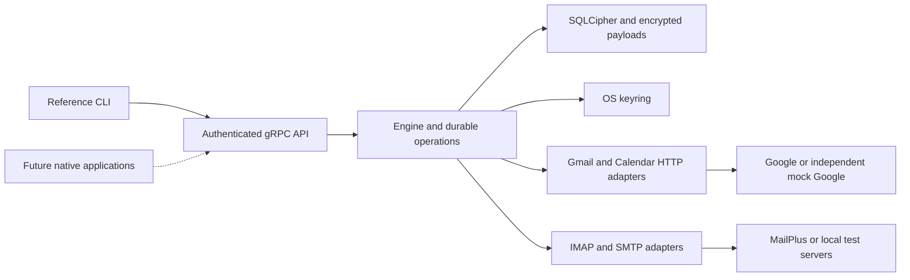

# Nuncio Google-First Rebuild Specification

**Status:** Accepted September 10, 2026; implementation is active in the isolated feature worktree.\
**Date:** September 10, 2026\
**Baseline:** `dev` at `a268fd5a004977b65fd0347ceeb1c69755529aa3`\
**Evidence:** [Engineering audit](../../reviews/2026-09-10-nuncio-audit-and-rebuild.md)\
**Execution:** [Implementation plan](../plans/2026-09-10-google-first-rebuild.md) and [copyable goal](../../GOAL-nuncio-rebuild.md).

## 1. Outcome and scope

Deliver a local-first, single-user email and calendar engine, operated entirely through a reference CLI and a versioned authenticated gRPC API. Google Gmail and Google Calendar are the first providers; Synology MailPlus follows through IMAP/SMTP. Native applications are a subsequent project. The read-only Google milestone is an intermediate checkpoint, not completion of this goal.

User-confirmed requirements are engine/CLI first, Google before IMAP/Synology MailPlus, and a mock Gmail provider for system and end-to-end tests. This specification extends the mock to the Google Calendar and OAuth surfaces the engine also needs. The full write-capable completion boundary and defaults below are proposed for adoption with the execution goal.

### Required capabilities

| ID | Requirement |
|---|---|
| R01 | Foreground daemon, explicit profile/data directory, authenticated loopback API, health/status, graceful shutdown, exclusive store ownership, and restart. |
| R02 | Google browser OAuth, refresh/reauthorization, account list/disconnect, and Synology credentials stored through the OS keystore. At least two accounts work without identity or credential crossover. |
| R03 | Gmail initial and incremental sync, complete paging, label/thread identity, deletions, expired-history recovery, original MIME, attachments, offline reads, and local search. |
| R04 | Google Calendar discovery, canonical event sync, agenda occurrences, correct dates/timezones/recurrence exceptions, deletions, and expired-token recovery. |
| R05 | Durable local drafts, compose/reply/reply-all/forward, attachments, recipient arrays, explicit sending account, sending through Gmail or SMTP, and inspectable submission history. |
| R06 | Read/unread, star/unstar, archive/trash/restore, Gmail existing-label add/remove, and IMAP folder move/copy, with provider capabilities exposed. Permanent purge is excluded. |
| R07 | Google Calendar create/update/delete, single-instance and whole-series edit scope, attendee responses, and explicit attendee-notification policy. Free/busy query is included; reminder delivery is excluded. |
| R08 | Persisted operations, local idempotency, safe retry classification, cancellation before dispatch, conflicts, outcome uncertainty, and recovery after process death. |
| R09 | Synology IMAP/SMTP read/write parity for the mail operations above, including folder encoding, UIDVALIDITY, incremental updates, remote deletion, and Sent-copy behavior. |
| R10 | Scheduled synchronization, cancellation, bounded concurrency, provider-aware backoff, catch-up after sleep/network recovery, account isolation, and observable progress. |
| R11 | Faithful raw EML export, attachment download, encrypted consistent backup and restore, schema migration, account removal semantics, and repair that preserves originals. |
| R12 | CLI/API parity, deterministic pagination, JSON results, correct exit statuses, byte streaming, recoverable change notifications, and explicit cache coverage. |
| R13 | Stateful mock Google provider with independently grounded HTTP/OAuth schemas, fault injection, and independently inspectable remote state and side-effect counts. |
| R14 | Offline system tests through the real Google HTTP adapter and real encrypted store; subprocess E2E through the actual daemon and CLI. Strict IMAP/SMTP verification also required. |
| R15 | Confidential database/FTS/payload/journal storage, key separation, no plaintext secret logging, TLS validation, inert mail display, bounded inputs, and production exclusion of test hooks. |
| R16 | Reproducible build, required CI gates, local installation/uninstallation instructions, contract artifact, and evidence-backed acceptance report. |

### Explicit boundaries

- Primary personal runtime: macOS. Linux runs the offline CI suites. Windows/native-client installation is outside this goal; avoid unnecessary platform assumptions in the domain/API.
- Synology scope is MailPlus email. Synology Calendar/CalDAV is excluded until requested. Google Calendar supplies the calendar capability.
- No JMAP, CardDAV/contacts synchronization, NSQL/filter automation, MCP, AI, plugins, push-webhook infrastructure, custom updater, or peer-to-peer sync.
- Drafts are durable locally. Cross-device draft synchronization and scheduled send are excluded. Multiple ordinary clients may use the same upstream account; local-only state is not replicated between engines.
- Calendar supports editing one occurrence or the entire series. “This and following,” organizer transfer, calendar sharing administration, and local reminder delivery are explicitly unsupported.
- Existing custom Gmail labels and existing IMAP folders can be used. Creating/deleting label or folder hierarchies is excluded.
- This goal does not migrate or replace an existing Nuncio database, install a background login agent, publish a release, or merge the rebuild into the root workspace.

## 2. Implementation location and boundaries

Implement a separate Cargo workspace under `rebuild/` on a feature branch. This keeps the existing implementation available as reference and makes adoption reversible. The nested workspace has its own manifest, lockfile, tests, data namespace, and four production crates:

| Path | Responsibility |
|---|---|
| `rebuild/crates/nuncio-engine` | Domain/application operations, encrypted storage worker, providers, synchronization, operation execution, secrets. |
| `rebuild/crates/nuncio-proto` | `nuncio.v2` protobuf definitions, generated Rust bindings, thin authenticated client helper. |
| `rebuild/crates/nunciod` | Process lifecycle, dependency composition, gRPC handlers, production policy enforcement. |
| `rebuild/crates/nuncio-cli` | Parsing, formatting/JSON, stdin/stdout, exit codes, client-side files. No engine/database dependency in normal dependencies. |
| `rebuild/crates/nuncio-test-support` | Test-only mock Google server, synthetic fixtures, mock keystore, protocol harnesses, subprocess helpers. Never shipped. |

The test-support crate is an unshipped workspace member. Its mock implementation and wire fixtures must not depend on the engine's provider serialization/domain models. System-test composition may use the engine's public entry point through dev dependencies; keep that composition in test modules, separate from the standalone mock's dependency graph. A `mock-google` binary permits manual offline exercises. Injectable credentials/Google endpoints are compiled into test-harness daemon builds only; mock controls remain exclusively in the harness/mock process.

Use Rust 2021, the repository's pinned Rust 1.97.1, Tokio, tonic/prost, Clap, serde, reqwest/rustls, established MIME libraries, and SQLite/FTS5. For this execution contract, choose **SQLCipher-backed SQLite through rusqlite**, isolated behind a dedicated storage thread and typed request channel. This supplies whole-database encryption without a custom column cipher. Pin compatible dependencies in the new lockfile; do not weaken security to work around packaging issues. The original SQLx store is reference material, not a mandatory dependency.

SQLCipher protects database and WAL page content; configure temporary storage in memory and verify the behavior rather than assuming every transient file is encrypted. The driver has documented bundled SQLCipher build features. [SQLCipher design](https://www.zetetic.net/sqlcipher/design/), [rusqlite features](https://docs.rs/crate/rusqlite/latest).

Use `127.0.0.1:9421` by default, independent of the original daemon's port. Default data root is `~/.nuncio-rebuild`; keyring service is `mx.nuncio.rebuild`, with keys scoped by profile and account. Tests always use temporary directories and ephemeral ports. Bind and acquire the store lock before accepting work. Never fall back to the original profile or keyring namespace.



## 3. State model and invariants

### Storage ownership

Provider objects are synchronized projections. Local drafts, operation intent, conflict resolution, configuration, and backup metadata are durable user state. Resync replaces only a named provider projection. It cannot delete local drafts or queued work. Schema upgrades are versioned and transactional; an older binary rejects a newer store. Corruption or a wrong key fails closed and leaves original files intact.

Keep original MIME and attachment bytes inside encrypted, chunked blob tables initially. Chunk size is 256 KiB; maximum accepted single payload is 64 MiB by default and configurable downward. Oversized content retains metadata and an explicit `too_large` availability state. Streaming APIs never put a complete large attachment into a single protobuf message. Export only downloaded originals, or explicitly fetch them as a separate operation; missing payloads cannot become successful empty files.

### Logical tables

All entity foreign keys carry account scope. Local IDs are opaque, stable identifiers; provider IDs remain separately stored strings.

| Tables | Identity and important fields |
|---|---|
| `accounts` | Local account ID, provider, address, credential reference, capabilities, sync configuration; no password/token. |
| `messages`, `collections`, `memberships` | Local ID and provider ID; Gmail thread/label membership; IMAP membership address includes mailbox, UIDVALIDITY, UID. No uniqueness assumption for Message-ID. |
| `message_headers`, `blob_chunks`, `message_search` | Original and parsed representations, byte hash/size, payload availability, FTS in the encrypted database. |
| `calendars`, `calendar_objects`, `calendar_occurrences` | Account/calendar/provider IDs, raw provider JSON, ETag, master/instance identity, cancellations, canonical time fields, cached occurrence window/revision. |
| `sync_scopes`, `sync_runs`, `staged_changes` | Provider cursor and query fingerprint, old/new projection generation, page continuation, completeness, coverage, observed errors. |
| `drafts`, `operations`, `operation_attempts` | Immutable request fingerprint, frozen send payload, source/destination/precondition, lifecycle state, provider receipt, redacted error. |
| `change_log`, `schema_migrations`, `backup_metadata` | Monotonic local revision, migration version, checksummed backup format. |

A transaction promotes a completed sync generation and its durable cursor together. Staging pages avoids a huge in-memory mailbox and prevents partial responses from becoming authoritative deletion snapshots. Incremental page application may be idempotently persisted before cursor advancement; the final cursor advances only when the entire cycle is durably represented. Cursors are opaque strings with provider/type tags; do not increment history IDs or interpret them as floating-point values.

### Calendar representation

Represent time as a tagged value: `Date { date }` or `DateTime { rfc3339, time_zone }`. Date-only ends remain exclusive. Retain recurring master ID, instance ID, original start, exception/cancellation status, attendees, reminders as data, and raw provider fields. Unknown fields survive read-modify-write; edits patch named fields rather than reconstructing a reduced event.

Synchronize canonical Google event resources with `singleEvents=false` and `showDeleted=true`, using a fixed query shape compatible with sync tokens. Separately fetch provider-expanded instances for a rolling agenda window: 30 days before today through 180 days after today. No window bounds are attached to a canonical incremental token request. Changing the agenda window refreshes its occurrence cache. Canonical changes invalidate affected occurrence coverage until refreshed; stale occurrences are never presented as current. Requests outside cached coverage report that fact and can request a refresh. [Google event model](https://developers.google.com/workspace/calendar/api/v3/reference/events), [event listing constraints](https://developers.google.com/workspace/calendar/api/v3/reference/events/list).

## 4. User/API contract

Every user-visible capability has one application operation, a protobuf RPC, a CLI command, and an acceptance test. HTTP provider structs never become the public API. Services are `System`, `Accounts`, `Mail`, `Calendar`, `Operations`, and `Maintenance`; each is authenticated independently. RPC names are defined in the task plan.

Commands below are the proposed grammar, not claims about existing binaries. Required account/profile arguments remove implicit sender selection.

```text
nuncio-cli system status
nuncio-cli system watch --after REVISION
nuncio-cli system shutdown
nuncio-cli account connect-google --client-config FILE
nuncio-cli account auth-status --session ID
nuncio-cli account add-imap --config FILE
nuncio-cli account list
nuncio-cli account disconnect --account ID
nuncio-cli sync --account ID --wait
nuncio-cli sync status --run ID
nuncio-cli sync cancel --run ID
nuncio-cli mail list --account ID --collection ID
nuncio-cli mail collections --account ID
nuncio-cli mail read --account ID --message ID
nuncio-cli mail fetch --account ID --message ID --wait
nuncio-cli mail search --account ID --query TEXT
nuncio-cli mail raw --account ID --message ID --output FILE
nuncio-cli mail attachment --account ID --message ID --part ID --output FILE
nuncio-cli mail draft save --account ID --file FILE
nuncio-cli mail draft list --account ID
nuncio-cli mail draft show --account ID --draft ID
nuncio-cli mail draft delete --account ID --draft ID
nuncio-cli mail draft attach --account ID --draft ID --file FILE
nuncio-cli mail reply --account ID --message ID --body-file FILE
nuncio-cli mail reply-all --account ID --message ID --body-file FILE
nuncio-cli mail forward --account ID --message ID --to ADDRESS
nuncio-cli mail send --account ID --draft ID --request-id UUID --wait
nuncio-cli mail change --account ID --message ID --action ACTION --request-id UUID
nuncio-cli calendar list --account ID
nuncio-cli calendar agenda --account ID --from DATE --to DATE
nuncio-cli calendar refresh --account ID --from DATE --to DATE --wait
nuncio-cli calendar get --account ID --calendar ID --event ID
nuncio-cli calendar change --account ID --calendar ID --file FILE --request-id UUID
nuncio-cli calendar free-busy --account ID --file FILE
nuncio-cli operation list --account ID
nuncio-cli operation show --operation ID
nuncio-cli operation cancel --operation ID
nuncio-cli operation resolve --operation ID --decision DECISION
nuncio-cli backup create --output FILE
nuncio-cli backup inspect --file FILE
nuncio-cli backup restore --file FILE --new-profile NAME
nuncio-cli repair --account ID --scope SCOPE --dry-run
```

Reply/reply-all/forward create an editable local draft; send is a separate explicit action. Change payloads are versioned JSON with named action, resource identity, and expected version where supported. The CLI documents examples and validates them before dispatch. `--json` is global: stdout contains one versioned result object, or documented JSONL for streaming; diagnostics go to stderr. Binary output and JSON are mutually exclusive. Exit statuses: 0 success/accepted enqueue, 2 invalid input, 3 authorization required, 4 unavailable/offline miss, 5 conflict/uncertain outcome, 1 other failure. `--wait` returns 0 only after the requested operation reaches its successful terminal state.

Queries read the local store and report synchronization age/coverage. Missing content requires an explicit fetch operation; it is not replaced by empty text. Listing is keyset-paginated with a revision-bound cursor; a changed snapshot gives a refresh-required error instead of skipping objects silently. Change notifications carry monotonically increasing revisions; expired revisions require a new snapshot. Retain 10,000 change records initially. Native clients can recover after disconnect without replaying a permanent domain event log.

## 5. Operation and synchronization policy

Operation states are `queued`, `running`, `applied`, `retry_wait`, `conflict`, `uncertain`, `failed`, and `cancelled`. Persist request ID and canonical payload hash under an account-scoped unique constraint. Reusing the same request ID/payload returns the original operation; reusing it for a different payload is rejected. Persist desired local state plus operation intent atomically. Freeze sending bytes and Message-ID when enqueueing; draft edits after enqueue cannot alter that submission.

Remote calls happen after commit. A crash during `running` becomes reconciliation work, not an unconditional resend. Retry idempotent desired-state mutations only where provider semantics allow it. A failed send/COPY acknowledgement is uncertain until positively reconciled; absence in an eventually consistent read is not proof of failure. Never manufacture Gmail idempotency from a custom header. For an unresolved send, expose “accepted status unknown” and require an explicit new-send decision before risking duplication.

Gmail supports label operations rather than arbitrary folder moves. Archive removes INBOX; trash/untrash use their specific endpoints. IMAP mutations address a placement explicitly. Use MOVE where available; verified fallback may use COPY plus safe UID-scoped deletion. Without a safe expunge path, return unsupported/conflict rather than expunging unrelated messages. SMTP acceptance and saving a Sent copy are separate substeps; failure to append a Sent copy retries only the append/reconciliation, never the accepted send.

Calendar updates use ETag preconditions. A 412 creates a conflict with the observed version; do not silently overwrite. New Google events use a stable client-chosen provider ID where allowed, enabling reconciliation after uncertain creation. Notification policy is explicit in the command payload. Mock tests count invitation effects independently from stored event state. [Calendar conditional changes](https://developers.google.com/workspace/calendar/api/guides/version-resources).

Schedule mail and calendar independently per account. Default poll interval: 60 seconds; global active-account limit: 2; one conflicting sync/write sequence per account; network request deadline: 30 seconds. Read retries use bounded exponential backoff with jitter, honoring longer provider retry guidance. Persistent credential failure pauses the account and requests reauthorization. Other accounts continue. Inject limits and time sources for tests; do not pause Tokio time around real SQLite/blocking I/O.

## 6. Mock Google provider contract — required

The mock is a test product with its own state, HTTP request validation, and contract suite. It must exercise the production HTTP adapter; returning domain structs from a mock backend does not satisfy R13/R14. It may implement only the endpoints used by this release, but every supported endpoint follows its documented semantics and every unsupported one fails explicitly.

### HTTP surfaces

| Surface | Required subset |
|---|---|
| OAuth | Authorization redirect with state and PKCE, one-use authorization code, token exchange, refresh, expiry, revoked refresh token, scope denial. |
| Gmail account/mail | `users.getProfile`, labels list, messages list/get (metadata/full/raw), attachments get, threads get, history list. |
| Gmail changes | Message modify, trash/untrash, message send. Local drafts use raw MIME on send; Gmail draft synchronization is not required. |
| Calendar | Calendar-list list, events list/get/instances/insert/patch/delete, freeBusy query. |

Gmail IDs/date/cursor fields must use the documented JSON types. Fixtures include noncontiguous history IDs greater than 2^53, base64url MIME, multipart messages, omitted optional fields, and Gmail-specific label/thread behavior. A pagination token is not a synchronization cursor: final Gmail history uses the returned `historyId`; final Calendar synchronization uses `nextSyncToken`. [Gmail messages](https://developers.google.com/workspace/gmail/api/reference/rest/v1/users.messages), [Gmail history](https://developers.google.com/workspace/gmail/api/reference/rest/v1/users.history/list).

### State, control, and faults

- Seed two Google accounts, two calendars per account, a message visible through several labels, a multipart PDF attachment, HTML-only mail, and fixed expected recurring instances spanning DST. No real messages or personal identifiers.
- Controls create/edit/delete remote objects, reorder results, expire history/sync tokens, revoke access, and change provider versions independently of the daemon.
- Faults include small server page caps, duplicate page overlap, an object deleted between list/get, invalid cursor, 401/403/404/410/412/429/5xx, malformed JSON, truncated bodies, latency, disconnect before acceptance, and **apply the mutation then withhold/drop its response**.
- Record request counts, accepted sends, message copies, invitation notifications, and resulting remote objects. Test assertions query these observations through harness controls, independently of CLI output.
- Hand-authored response fixtures derive from linked official references. The mock cannot import production request/response structs, generate expectations from daemon output, silently accept misspelled fields, or pretend to implement undocumented idempotency.
- The mock's own tests prove valid requests succeed, invalid requests fail, page/cursor semantics work, and every fault has its intended effect. A mock failure is not fixed by weakening request validation to match a broken client.
- Provider endpoints bind loopback only. Test controls are out-of-band and unavailable to the production adapter. The standalone mock has a deterministic reset/seed command and announces bound ports through a readiness file, not fixed sleeps.

## 7. Verification and completion

1. **Unit:** domain identity/time conversion, MIME fidelity, state transitions, crypto/key handling, provider response decoding, query boundaries.
2. **Provider conformance:** mock Google validates independent wire fixtures; IMAP uses strict syntax tests plus a local independent server implementation and SMTP sink for protocol acceptance.
3. **System:** real application, encrypted store, provider HTTP adapters, and authenticated API against stateful mock Google. Direct storage seeding cannot stand in for provider ingestion.
4. **E2E:** actual `nunciod` and `nuncio-cli` subprocesses, HTTP mock, isolated profile, mock secrets, real restarts/forced termination. Test through commands; inspect provider side effects independently. Keep system and E2E as separate required gates.
5. **Release-build checks:** production binaries reject test endpoint/credential flags; all services reject unauthenticated calls; outputs contain no synthetic secret canaries; database/WAL/backup contain no plaintext content canary and cannot be opened with an ordinary SQLite connection or wrong key.
6. **Live acceptance:** separate, explicitly authorized manual exercise on named disposable Google and Synology accounts. No normal test or CI job accesses live services. Missing live access is recorded as pending and does not prevent completing independent code/test work. A fully provider-validated claim requires this evidence; passing the mock alone cannot supply it.

Security limits are concrete: no remote plaintext authentication, no disabled certificate verification, no credentials in configuration/argv/logs, no raw server error URLs with tokens, no secret-bearing Debug output, no automatic loading of remote HTML resources, and safe filenames on attachment/export paths. Terminal output removes escape/control sequences from untrusted fields; original byte downloads remain byte-for-byte original. HTML stays inert; a future renderer must impose its own sandbox.

Acceptance must include three independent engines converging against one mock account after external changes, plus separate send/copy/notification counts. The engine is not responsible for synchronizing local drafts between these profiles. Tests use event-driven readiness and bounded waits; no discarded assertions, ignored failures, invented success counts, or fixed sleeps as a substitute for synchronization.

The final report contains a requirement-to-test matrix for R01–R16, commands/exit statuses, newly measured test counts, protocol compatibility limitations, backup/restore evidence, artifact paths, dependency/security checks, and live-acceptance status. Building a mock or passing a read-only milestone does not complete the full goal.

## 8. Recovery and provider-specific identity details

Backups use a consistent SQLCipher snapshot, separately encrypted with a recovery passphrase through supported SQLCipher key derivation/export facilities. Read that passphrase through hidden terminal input or a protected input channel; never put it in argv, configuration, or logs. The passphrase is required to restore and has no reset path. Backups include durable drafts and operation records, but exclude provider credentials and API bearer tokens. Restore only into a new profile, require provider reconnection, and hold pending outbound work for reconciliation before dispatch. Projection repair must retain originals on corruption or failure; it cannot substitute an empty database for an unreadable one.

For Gmail, a message entity is unique by account plus Gmail message ID, with many label memberships. For IMAP, identify each remote placement by account, stable local mailbox identity, UIDVALIDITY, and UID. Initially retain a separate message record per IMAP placement rather than guessing cross-folder identity from Message-ID. Shared payload storage may use verified byte hashes, but identical bytes do not prove that two remote messages are one entity. Encode compound provider keys unambiguously, never by unsafe delimiter concatenation.

Account disconnect pauses the account and removes its credential reference/secret while preserving cached data, local drafts, and operation history. Reconnection must prove the same provider account identity. Destructive local account purge is outside this goal; disconnect must not masquerade as purge or silently erase durable user state.
