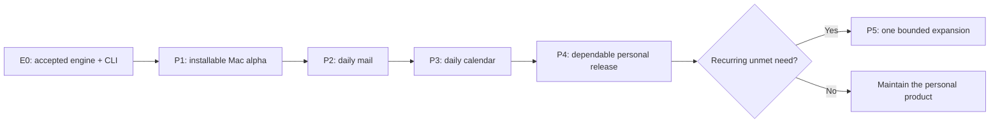

# Post-engine product roadmap

**Status:** Proposed priorities for review, September 12, 2026. Planning is authorized; execution of these future milestones is not. This document does not expand or declare completion of the current engine/CLI goal.

## Recommendation

Make Nuncio James's dependable daily mail and calendar application on his Apple Silicon Mac before adding another platform. Start with an installable native app that proves the complete path from download through account connection to a useful inbox and agenda. Then deliver mail, calendar, and sustained daily reliability in that order. The recommendation assumes inbox triage and replying are the most frequent jobs; actual usage can justify swapping the mail and calendar milestones.

The product is a personal, single-user tool with multiple accounts: Gmail and Google Calendar, followed by Synology MailPlus mail through IMAP/SMTP. Success means James can understand his day, handle correspondence, and trust the result without operating the CLI. Public growth, cloud hosting, multi-user collaboration, every desktop/mobile platform, and AI are optional future decisions.

## Boundary and engine completion gate

The approved [September 10 specification](../../docs/superpowers/specs/2026-09-10-google-first-rebuild.md), [implementation plan](../../docs/superpowers/plans/2026-09-10-google-first-rebuild.md), and [account-management plan](ACCOUNT-MANAGEMENT-PLAN.md) define the current commitment. The [session state](SESSION-STATE.md) owns its changing delivery status. The engine/CLI goal remains incomplete while live provider and native-keystore acceptance are deferred. Successful mocks, earlier CI, and an older archive cannot close those checks or qualify newer source.

**E0 — current engine/CLI completion** is the prerequisite for starting native implementation:

1. Current approved requirements have engine, authenticated API, CLI, independent automated evidence, and passing applicable local and hosted gates for the delivered source. Account lifecycle behavior is included.
2. A current daemon/CLI package has verified provenance, checksums, extraction checks, documented platform limits, and tested backup/recovery behavior. Its source and compatibility identifiers are recorded.
3. James has separately authorized and completed the named Google, Synology/MailPlus, and native-keystore checks in [MANUAL-ACCEPTANCE.md](MANUAL-ACCEPTANCE.md), including independently observed remote effects and final cleanup/sign-off. Any failure is resolved and reverified.
4. James accepts the known limitations and confirms the engine/CLI handoff. Remaining optional features are explicitly outside that baseline.

These are existing delivery obligations, not new native-app prerequisites imposed on the current goal. A future UI usability gap may require an engine/API/CLI change; it becomes an explicit follow-up with its own evidence. Planning here neither accesses live accounts nor authorizes their use.

## Sequence and planning assumptions

Effort ranges assume one senior engineer comfortable with Rust and Swift, approximately 25 focused project hours per week, James providing 1–2 hours of feedback weekly, and no dedicated designer, QA engineer, or support team. The ranges include integration and ordinary hardening, with roughly one quarter of capacity reserved for defects and maintenance. They exclude E0, external approval waits, and major new engine capabilities. They are planning estimates with medium-to-low confidence, not delivery dates; part-time availability stretches elapsed time proportionally.

| Horizon | Milestone and user outcome | Indicative effort | Release decision |
|---|---|---|---|
| Now — committed | **E0: finish the current engine and CLI.** Establish trusted behavior on James's actual providers and native keystore. | Owned by current delivery; not re-estimated here | Existing acceptance and sign-off |
| Next — proposed | **P1: installable native Mac alpha.** Open one app, connect accounts, and read an inbox and today's agenda. | 4–6 engineering weeks | Private native alpha for James |
| Then — proposed | **P2: daily mail.** Read, find, organize, draft, and send ordinary correspondence without the CLI. | 5–8 weeks | Mail becomes the primary client for agreed workflows |
| Then — proposed | **P3: daily calendar.** Plan the day and manage supported events and invitations confidently. | 4–6 weeks | Mail and calendar work together in daily use |
| Then — proposed | **P4: dependable personal release.** Survive upgrades, sleep, failures, and recovery with manageable support effort. | 4–7 weeks, including observation time | Personal stable candidate; broader beta is a separate choice |
| Later — conditional | **P5: one proven expansion.** Address the largest remaining recurring job or access gap. | Re-estimate after a 1–2 week discovery/spike | Approve one bet from the expansion table |

The proposed core path is approximately **17–27 engineering weeks after E0** at this capacity. First native value should arrive in P1. Re-estimate after P1 using actual Swift integration, packaging, and usability results; do not turn the total into a promised calendar date. Signing and OAuth dependencies can delay distribution even when implementation is ready.

The critical path is E0 → a real native API consumer and secure app lifecycle → complete mail/calendar tasks → observed reliability. UX sketches and distribution decisions can be prepared in planning, but multiple client implementations should not compete for the one engineering workstream. Accessibility, security, recovery, and compatibility are continuous requirements from P1; P4 validates them over time.

## P1 — An installable native Mac alpha

**Job:** “I can open Nuncio and see my mail and day without managing a daemon.” Prefer SwiftUI with a thin native client in a separate client repository, consistent with the existing engine-first direction. Keep persistence, provider credentials, account state, and mutations in the daemon. Start with account setup/status, inbox and message reading, and a read-only agenda. Present disconnected, paused, expired-auth, and stale/offline states clearly.

Use the [API publication proposal](API-PUBLICATION-PLAN.md) for the minimum needed consumer contract: a versioned API artifact, a generated Swift client, documented authentication, and compatibility tests against the real packaged daemon. A private consumer artifact is sufficient to prove this path; a public registry, multiple SDKs, or a new gateway is unnecessary. Public API/SDK publication remains a separate authorized delivery.

**Exit evidence:**

- James completes install, launch, account connection, inbox reading, and agenda viewing on his Mac and a clean test user profile using downloaded binaries. No compiler or routine terminal operation is required. One-time provider project setup, if still required, is explicit and measured.
- The signed daemon/helper accesses its intended native Keychain credentials; the native client receives only the local API authorization it needs. The combination selects the correct isolated profile, rejects mismatched API/authentication, and reconnects after daemon restart and sleep/wake. Quitting and background-operation behavior are documented and controllable.
- A client built from the extracted contract artifact exercises the packaged daemon without importing engine/storage code. App, engine, and API identities appear in diagnostics; unsupported combinations fail with actionable guidance.
- Inbox and agenda navigation work with keyboard and VoiceOver. Cached content is visibly distinguished from synchronized content. On an agreed 10,000-message fixture, target cached initial content within 2 seconds at the 95th percentile across 20 measured launches; revise the provisional budget only with recorded device/data evidence.
- Hostile-message fixtures cannot execute scripts, load remote tracking content by default, or obtain daemon credentials. The download-to-launch test verifies the intended signing/notarization experience without disabling Gatekeeper.

**Dependencies and risk:** E0, Apple development/signing access, Swift gRPC integration, signed-helper/Keychain behavior, and the initial app/daemon lifecycle decision. Timebox the consumer and signed-package spike to the first 1–2 weeks within this milestone. If it fails, resolve that boundary before building more screens. The existing [testing installer](TESTING-INSTALL.md) supplies daemon/CLI testing infrastructure; it is not a signed or notarized native app.

## P2 — Mail becomes the daily tool

**Job:** “I can work through incoming mail and send the right response from the right account.” Deliver account-aware inboxes, search, message/thread reading where supported, attachments, compose/reply/forward, durable drafts, and the supported label/folder, archive, trash, and restore actions. Make sending identity, pending changes, authentication needs, and uncertain delivery visible. Offer deliberate recovery actions grounded in engine receipts.

**Exit evidence:**

- An agreed task script covers Gmail and MailPlus: find a message, open/save an attachment, reply/forward with the correct identity, preserve a draft across restart, send, archive, trash, and restore. All supported tasks pass through the actual app and daemon; explicitly authorized live cases verify the provider outcome independently.
- Offline, token-expiry, reconnect, conflicting edits, and crash cases retain drafts and operation intent. Accepted or uncertain sends are never silently resubmitted. Displayed delivery and Sent-copy states match the engine's distinct evidence.
- Across 10 working days, James completes at least 80% of the previously agreed eligible mail tasks in Nuncio without CLI assistance. Record fallback reasons and the denominator in a private task diary; unsupported tasks remain visible in the broader diary so the metric cannot improve by hiding gaps.
- No unresolved data-loss, cross-account disclosure, or duplicate-send defect remains. The complete task script is keyboard operable; recipient and attachment mistakes are recoverable before dispatch.

**Dependencies and scope control:** P1 and the existing account/draft/operation APIs. New provider-side folders, contacts sync, rules, scheduled send, or legacy-data import require a separate prioritized capability; they are not assumed to exist because a familiar mail UI commonly offers them.

## P3 — Calendar supports the working day

**Job:** “I can understand my availability, respond to invitations, and change an event without surprising attendees.” Deliver an agenda and practical day/week views, timezone-aware event details, supported event creation/editing/deletion, invitation responses, and available free/busy information. Keep Google Calendar as the calendar provider; MailPlus support does not imply Synology Calendar support.

**Exit evidence:**

- The app task script covers timed/all-day events, timezone and daylight-saving boundaries, a recurring series and a single occurrence, invitation response, cancellation, and conflict handling. Live attendee/notification effects are checked only on named, authorized resources.
- The UI accurately states edit scope and notification intent before a write and represents uncertain remote outcomes afterward. Unsupported “this and following,” sharing administration, and reminder delivery are not presented as available.
- Across 10 working days, James completes at least 90% of agreed eligible mail/calendar tasks without the CLI and uses Nuncio for his daily agenda review. Record missing workflows and wrong-time or wrong-scope incidents separately; no unresolved incident affecting an event or attendee is acceptable at exit.
- Time and account distinctions remain understandable with keyboard navigation, VoiceOver, and non-color cues. Offline views and pending edits never masquerade as fresh confirmed provider state.

**Dependencies and scope control:** P1's native foundation and P2's operation/recovery presentation patterns. A small, explicitly specified reminder capability can be promoted if James's diary shows it blocks daily use; it needs engine/API/CLI behavior and native delivery acceptance. Do not hide new reminder semantics inside presentation code.

## P4 — A dependable personal release

**Job:** “Nuncio stays useful over weeks, and I know how to recover when something goes wrong.” Complete upgrade and recovery UX, understandable account repair, privacy-preserving diagnostics, version/support documentation, and the chosen background/notification behavior. Keep manual, user-initiated updates initially. An unattended updater is a separate decision with its own trust and rollback design.

**Exit evidence:**

- Observe 30 calendar days with at least 20 active-use days on the release candidate or documented compatible fixes. There are no open critical defects involving data loss, privacy, duplicate remote writes, or wrong attendee effects, and no unresolved blocker in an agreed daily workflow. A material state/auth/upgrade fix restarts observation of the affected scenario.
- Test fresh installation and upgrade from every version declared supported in the small compatibility matrix. Verify failure recovery, preserved account isolation, and incompatible-schema refusal. Rollback promises apply only to compatible data; otherwise recovery uses a documented tested backup path.
- James performs a backup/restore and reauthorization drill on a named test profile without developer intervention, targeting 30 minutes for the agreed reference dataset, excluding provider authentication delays. A failed drill produces a usability fix and retest.
- Measure sleep/wake reconnect, prolonged offline use, memory growth, and idle CPU/battery behavior on James's Mac against the baseline and written budgets agreed in P1. No unexplained continuing growth or repeated idle polling regression is left open; later hardware claims require their own measurements.
- A diagnostic export lets James inspect what will be shared and excludes tokens, message bodies, attachment data, and account identifiers by default. Installation, update, recovery, and known-limit instructions reproduce the delivered build. Two consecutive weeks require no more than two unplanned maintainer hours per week, as a personal sustainability signal rather than a support SLA.

**Release decision:** James can choose a stable personal installation here. A 3–5 person trial is optional and requires a separately approved distribution, OAuth, privacy, and support plan. A public launch, App Store submission, paid offering, or service availability commitment is not an exit requirement.

## Architecture and distribution decisions

| Decision | Recommended starting position | Evidence required before widening it |
|---|---|---|
| Native client boundary | One Mac client; generated authenticated gRPC; no direct database access or duplicate provider engine | Actual app/daemon acceptance, not API method counts, proves each supported workflow. Keep the [original architecture decision](../../docs/adr/0001-engine-first-grpc-architecture.md)'s thin-client principle while using the rebuild's current contract and endpoint. |
| Desktop packaging | Direct private distribution with Developer ID signing and notarization; a user-scoped helper and explicit background controls | Validate signing identity, Keychain access, helper lifecycle, entitlements, upgrade, and clean-Mac launch together in P1. Apple documents Developer ID and notarization for software distributed outside the store; CI artifact hashes alone do not establish either. [Apple distribution guidance](https://developer.apple.com/developer-id/) |
| Sandbox and rendering | Minimize native entitlements and isolate untrusted email rendering from the authenticated client | Test the real helper, network, and selected-file access paths. App Sandbox restricts resources through entitlements; its fit must be tested rather than assumed from a UI framework choice. [Apple App Sandbox](https://developer.apple.com/documentation/security/app-sandbox) |
| API and SDK delivery | Implement the smallest independently consumable contract/Swift client needed for P1; preserve separate app/API/SDK version identities | Extracted-artifact consumer and supported-version compatibility tests before distribution. Publish only when an actual external consumer needs it and publication is authorized. [API plan](API-PUBLICATION-PLAN.md) |
| Google onboarding beyond James | Resolve actual scopes, OAuth project ownership, audience, and applicable verification exceptions before recruiting testers | Personal-use exceptions exist; third-party server access to restricted data can introduce security-assessment obligations. Reassess the actual deployment before a wider beta or relay, without assuming either exemption or mandatory assessment for every personal desktop app. [Google restricted-scope guidance](https://developers.google.com/identity/protocols/oauth2/production-readiness/restricted-scope-verification) |
| Mobile architecture | Defer implementation; first compare a phone-local engine with a companion/relay model for a specific away-from-Mac job | iOS schedules background refresh/processing and does not promise an always-running desktop daemon. Measure foreground/offline needs and notification latency before choosing. [Apple background strategies](https://developer.apple.com/documentation/backgroundtasks/choosing-background-strategies-for-your-app) |

Any future remote/mobile connection is a new security boundary: device enrollment, transport protection, revocation/lost-device behavior, credential ownership, encrypted caches/backups, and notification privacy need an explicit design and acceptance plan. The current loopback bearer API must not simply be exposed on a network. A companion service would also create operating cost and availability obligations; shared local drafts do not automatically become cross-device synchronized drafts.

## P5 — Expansion only when usage earns it

Select at most one expansion after the core product is sustainable. A recurring need should appear at least weekly over a month and matter enough to displace maintenance capacity. First validate the smallest useful task, define its acceptance script and ongoing cost, then estimate the delivery. These are options, not accumulated commitments.

| Candidate bet | Evidence that would justify it | Smallest next step and boundary |
|---|---|---|
| Faster personal workflows | Repeated manual filing, reminders, or searches dominate the fallback diary | Pick one capability, such as folder management. Use a 1–2 week discovery, then a bounded engine/API/CLI + Mac slice. Filtering and scheduled send each carry different data/side-effect rules. |
| Contacts and address book | Recipient lookup or address mistakes recur often enough to impede correspondence | Start with one address-completion source and explicit access permissions. Provider synchronization needs a separate plan for identity, duplicates, conflicting edits, and deletion; it is not implied by compose completion. |
| Another provider | James actually uses an unsupported account/calendar and cannot meet the job through current providers | A protocol/capability and authentication spike, independent conformance fixtures, then one provider. CalDAV/Synology Calendar, CardDAV, JMAP, and additional mail services remain separate proposals. |
| Mobile access | A recurring away-from-Mac job remains painful after the Mac product is dependable | A 1–2 week architecture/security experiment around one read/triage or agenda job; re-estimate after measuring background and offline limits. No automatic commitment to both iOS and Android. |
| Another desktop or TUI | An identified user/device needs it and someone can maintain its releases and platform tests | Build one independently generated API consumer and one end-to-end workflow. Windows/Linux desktop parity requires its own native lifecycle, keystore, accessibility, and distribution evidence. |
| API/SDK ecosystem or automation | A named consumer repeatedly needs a stable integration that the CLI cannot reasonably serve | Publish one contract/SDK or add one narrowly scoped automation surface with versioning and compatibility ownership. MCP, broad plugins, and autonomous remote writes require separate authority and threat-model decisions. |
| AI assistance | James can identify a recurring task with measurable time saved and acceptable quality/privacy costs | Evaluate an opt-in, reviewable draft or read-only suggestion against a small reference set. Treat email as untrusted input; require explicit action approval and a decision on local versus external processing. No automatic send, opaque model dependency, or cloud requirement is presumed. |

Public growth, multi-user hosting, billing, collaboration, and enterprise administration need a new product case and maintenance budget. They are not the inevitable next phase of a successful personal tool.

## Keep delivery manageable

- Maintain one active milestone and one small end-to-end capability at a time. Plan the next fortnight in detail; keep later milestones at this level until usage supplies evidence.
- Demo against the actual packaged daemon every two weeks. Each capability requires applicable engine/API/CLI regression coverage plus native interaction and accessibility evidence. Provider mocks support development; named live checks establish real interoperability when authorized.
- Keep a private weekly diary of tasks, fallbacks, correctness incidents, and maintenance time. Do not add a telemetry service merely to measure one person's product.
- Treat data loss, cross-account disclosure, duplicate remote writes, and misleading success as stop-the-line defects. Do not begin platform/provider expansion while one remains unresolved.
- Keep a small explicit app/engine/API/OS support matrix and an upgrade path. Increase supported combinations only when their test and support cost is affordable.
- At each exit, James chooses continue, narrow, reorder, or maintain. Remove low-value scope before reducing security, recovery, accessibility, or truthfulness. A useful maintained personal product is a valid endpoint.

## Decisions to settle before P1 execution

1. Confirm the assumed first daily workflow: inbox/reply first, or calendar first.
2. Confirm private use only versus a later small invited trial, and who owns Apple signing and Google OAuth configuration.
3. Choose the initial supported macOS range and app background/notification defaults from James's actual machine and privacy preferences.
4. Confirm available weekly engineering time; revise the estimates after the native consumer/package spike.

No answer is required to complete this planning document. These decisions belong at the future milestone start, after E0 and explicit authorization for native development.

## Basis and historical separation

The [September 10 audit](../../docs/reviews/2026-09-10-nuncio-audit-and-rebuild.md) motivates independent evidence and restrained scope; its findings describe the audited original implementation, not current rebuild defects. The [original roadmap](../../docs/ROADMAP.md) remains preserved for that application. Its contacts, filters, providers, client milestones, and old API details do not silently transfer into the approved rebuild or this proposed sequence. Current operating facts live in [RUNNING.md](RUNNING.md), [ACCOUNT-MANAGEMENT.md](ACCOUNT-MANAGEMENT.md), and [COMPATIBILITY.md](COMPATIBILITY.md). Platform references above were checked on September 12, 2026 and should be rechecked before the corresponding implementation decision.
