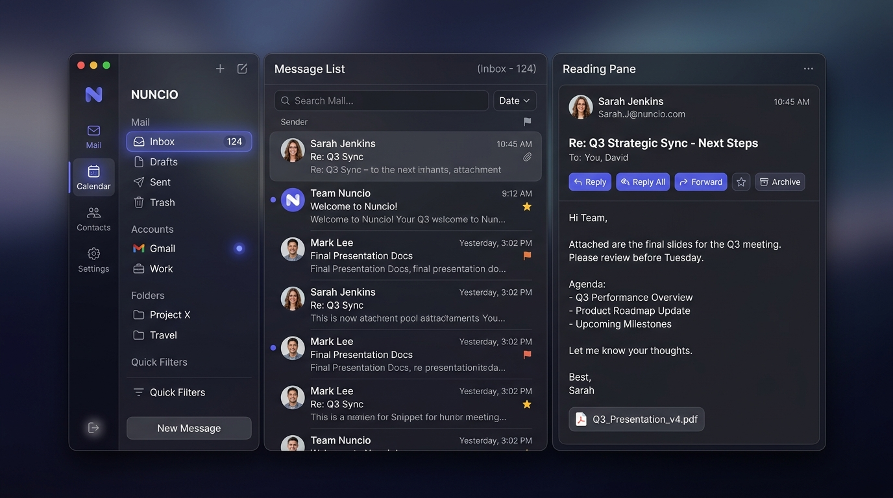
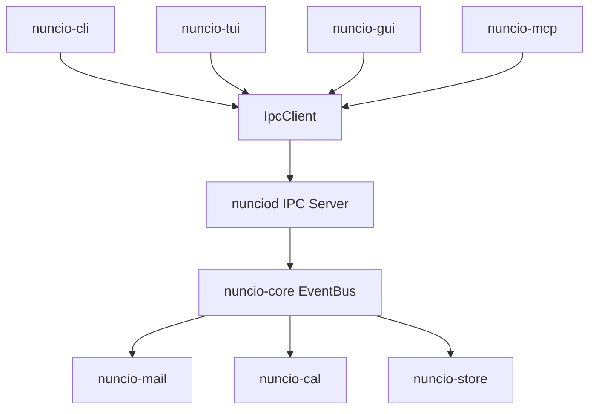

# Welcome to the Nuncio Wiki

Nuncio is a high-performance, library-first cross-platform mail and calendar suite for Windows, macOS, and Linux.

Official Site: [nuncio.mx](https://nuncio.mx) | GitHub Repository: [KofTwentyTwo/nuncio](https://github.com/KofTwentyTwo/nuncio)

---

## Visual Application Preview

---

## 4 Presentation Interfaces + Central Daemon

- **`nuncio-cli` (POSIX CLI)**: Pure Noun + Verb scriptable interface (`--json`).
- **`nuncio-tui` (Terminal TUI)**: Keyboard-first split-pane interface powered by Ratatui.
- **`nuncio-gui` (Tauri v2 Desktop GUI)**: Native desktop window with React 18 + Vite + TypeScript frontend.
- **`nuncio-mcp` (Native LLM Agent UI)**: Model Context Protocol (MCP) JSON-RPC 2.0 stdio server for AI agents.
- **`nunciod` (Central Daemon Binary)**: Standalone background process owning SQLite WAL storage, security enclaves, background protocol sync loops, and multi-client IPC socket streams.

---

## System Topology Diagram

---

## Wiki Navigation

1. **[NSQL Filter Language Specification](NSQL-Filter-Language-Specification)**: Complete formal EBNF grammar, language syntax reference, security specifications, real-world examples, and 4-shell how-to guide for Nuncio SQL Filters.
2. **[Multi-Shell Parity Matrix](Multi-Shell-Parity-Matrix)**: Comprehensive audit matrix verifying 100% 1:1 feature parity across CLI, TUI, GUI, and MCP interfaces.
3. **[Architecture Specification](Architecture-Specification)**: Hybrid Daemon-First Architecture (`nunciod`), 4-byte length-prefixed IPC framing, database encryption at rest, and zero-trust sandboxing.
4. **[Roadmap and Phases](Roadmap-and-Phases)**: Master V1, V2, and V3 micro-feature breakdown for commercial mail and calendar parity.
5. **[Executive Review](Executive-Review)**: Authoritative technical audit scorecards across architecture, security, code standards, UI/UX, and performance.
